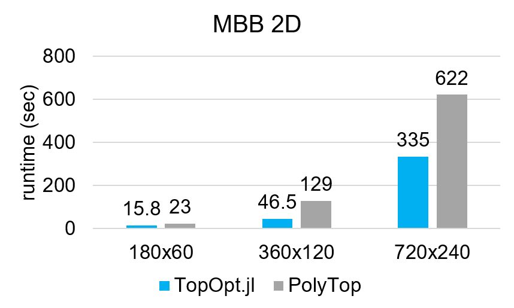
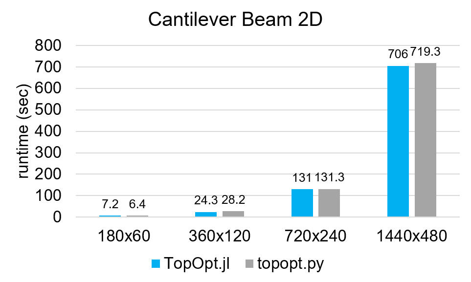
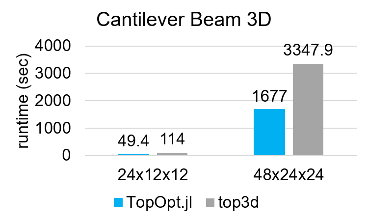
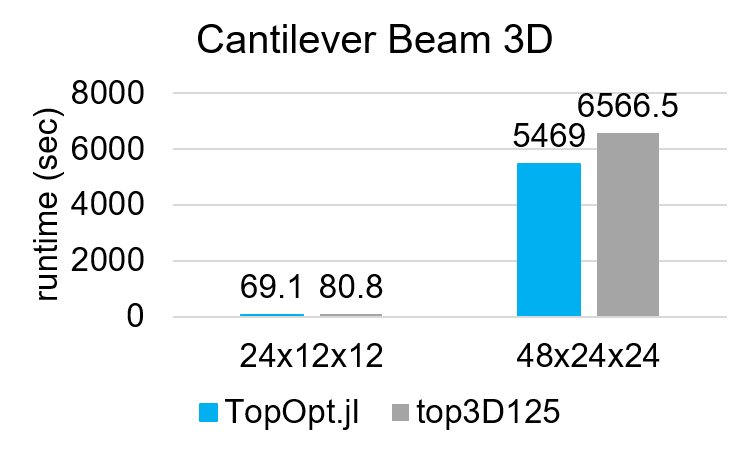

# TopOpt.j benchmarks

This repo constains benchmarks and demos for [TopOpt.jl](https://github.com/mohamed82008/TopOpt.jl), as supplementary materials for the abstract submitted to [WCSMO-14 (2021)](https://www.wcsmo14.org/).

## WCSMO-2021 recorded talk

<a href="http://www.youtube.com/watch?v=27oac8h3V2k">
   
</a>

## Citation

- [TopOpt.jl: Truss and Continuum Topology Optimization, Interactive Visualization, Automatic Differentiation and More](https://web.mit.edu/yijiangh/www/papers/topopt_jl_WCSMO2021.pdf)

```bibtex
    @inproceedings{huang2021topoptjl,
      title={TopOpt.jl: Truss and Continuum Topology Optimization, Interactive Visualization, Automatic Differentiation and More},
      author={Huang, Yijiang and Tarek, Mohamed},
      booktitle={Proceedings of the 14th World Congress of Structural and Multidisciplinary Optimization},
      year={2021}
    }
```

## Benchmark results

### Summary







### Detailed data